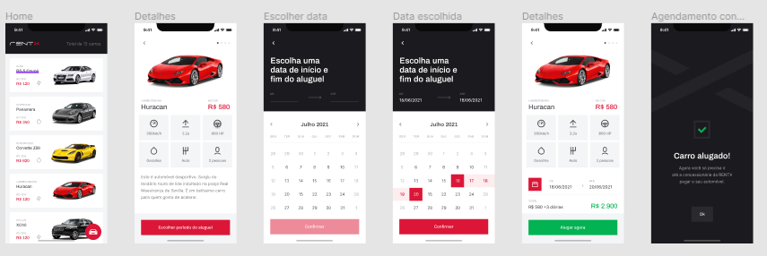

# rent-X

This application is a car rental manager, it can be possible to schedule a rental for a period, check the rented cars and check the information of a vehicle.

# How to test the App?

* Step 1 

  After downloading the app and API, run the command below to download the dependencies:
  
``` 
yarn install
```
* Step 2 

  Now, open in a terminal tab and run the start command below:
``` 
npx react-native start
```
* Step 3 
In a second terminal tab and run the command to emulate on your device or emulator:

Android:
``` 
npx react-native run-android
```

iOS: 
``` 
npx react-native run-ios
```
## Technologies used

* Expo Go
* TypeScript
* React Native
* Styled Components
* AsyncStorage
* React Native Reanimated
* Calendars


